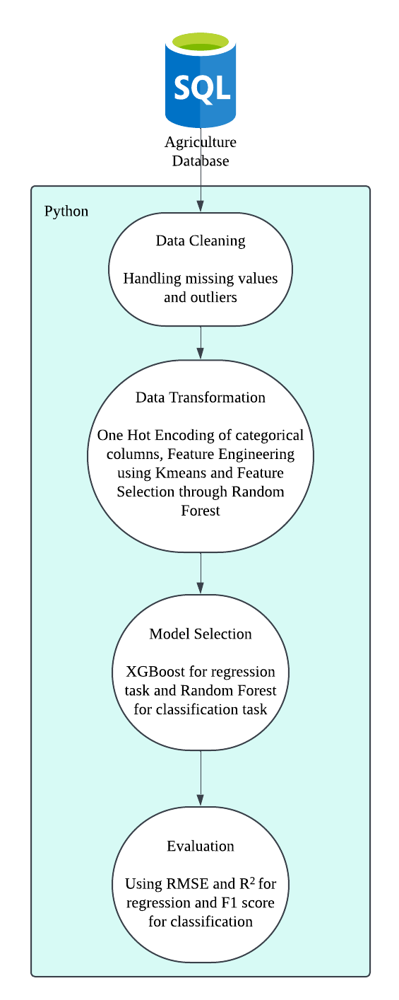
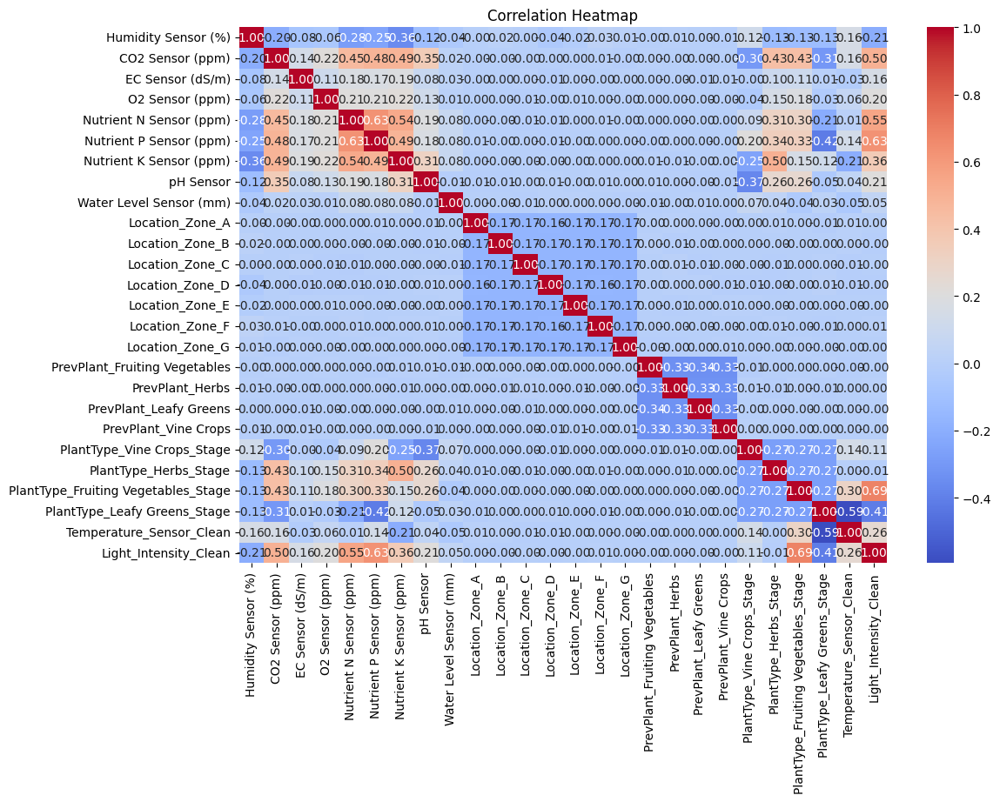
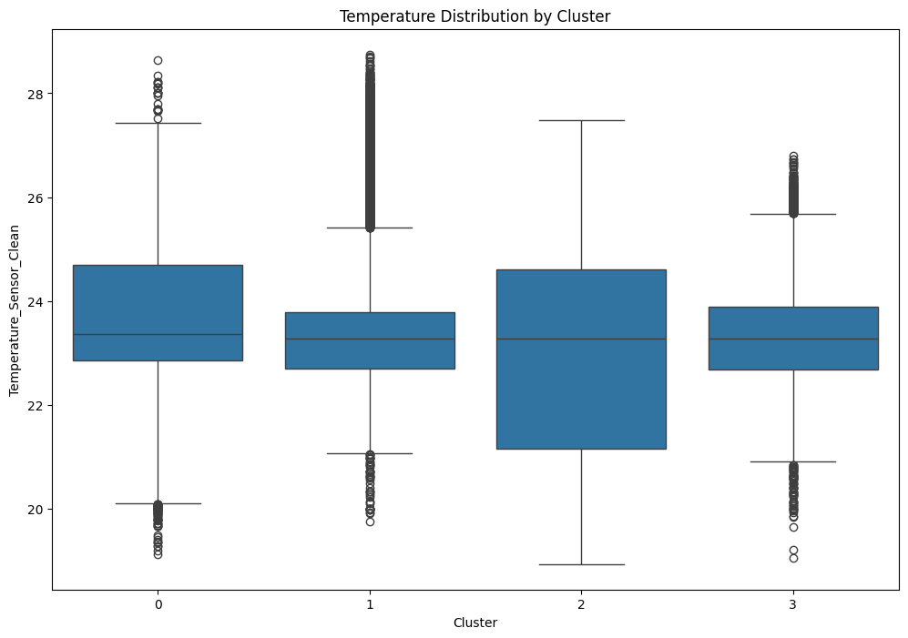

# Agricultural Machine Learning Pipeline

## Personal Information
- **Full Name:** Justin Tan Yong An
- **Email:** 2302675@sit.singaporetech.edu.sg

## Folder Structure
```
aiip5-NAME-NRIC/
├── .github/             # GitHub Actions configuration
├── data/                # Directory for storing the database file (not included in repository)
├── src/                 # Source code for the ML pipeline
│   ├── __init__.py      # Package initialization
│   ├── config.py        # Configuration settings
│   ├── main.py          # Main entry point
│   ├── model.py         # Model implementations
│   ├── train.py         # Training functionality
│   └── utils.py         # Utility functions
├── eda.ipynb            # Exploratory Data Analysis notebook
├── README.md            # This file
├── requirements.txt     # Dependencies
└── run.sh               # Bash script to execute the pipeline
```

## Instructions for Executing the Pipeline

1. **Setting up the environment:**
   ```bash
   # Create a Python virtual environment (recommended)
   python -m venv env
   
   # Activate the virtual environment
   source env/bin/activate  # On Unix/macOS
   # or
   env\Scripts\activate  # On Windows
   
   # Install dependencies
   pip install -r requirements.txt
   ```

2. **Prepare the database:**
   - Place the `agri.db` file in the `data/` directory

3. **Run the pipeline:**
   ```bash
   # Execute the pipeline using the bash script
   bash run.sh
   ```

4. **Pipeline parameters:**
   - The pipeline is configured to use hyperparameter tuning by default
   - Plots are disabled by default for headless execution
   - These settings can be modified in the `config.py` file

## Pipeline Flow
<p align="center">
  
</p>
<p align="center"><em>Figure 1: Flowchart of Pipeline</em></p>

1. **Data Loading and Preprocessing:**
   - Load data from the SQLite database
   - Process and clean the data
   - Create plant type-stage combinations for classification
   - Split data for temperature prediction and plant type-stage classification

2. **Feature Selection and Engineering:**
   - Apply feature selection based on correlation and importance analysis
   - Engineer features using clustering to capture complex patterns
   - Filter the most relevant features for each task

3. **Model Training and Evaluation:**
   - Temperature Prediction: Train XGBoost regressor with hyperparameter tuning
   - Plant Type-Stage Classification: Train Random Forest classifier with hyperparameter tuning
   - Evaluate models using appropriate metrics
   - Perform cross-validation to assess model robustness

4. **Model Persistence:**
   - Save trained models to disk for future use

## Key Findings from EDA

The exploratory data analysis revealed several important insights that informed the pipeline design:

1. **Feature Correlations:**
<p align="center">
  
</p>
<p align="center"><em>Figure 2: Correlation heatmap showing relationships between environmental variables</em></p>
   - The correlation heatmap showed relatively weak linear relationships between most features and the temperature target
   - Strongest correlations were found between:
     - Nutrient sensors (N, P, K) showed moderate correlations with each other
     - Light intensity showed a positive correlation with temperature (r = 0.258)
     - Plant type and growth stage showed varying correlations with temperature

2. **Temperature Relationships:**
   - Different plant types require different temperature ranges at various growth stages
   - Leafy greens showed a strong negative correlation with temperature (r = -0.595), indicating they thrive in cooler conditions
   - Fruiting vegetables showed a positive correlation with temperature (r = 0.299)
   - These relationships supported the hypothesis that different plant types and stages require different optimal temperatures

3. **Cluster Analysis:**
<p align="center">
  
</p>
<p align="center"><em>Figure 3: Temperature Distribution by Cluster</em></p>
   - K-means clustering revealed distinct environmental patterns
   - Temperature distributions varied significantly across clusters
   - Cluster membership provided valuable information for both prediction tasks
   - Including cluster features improved model performance

## Feature Processing

| Feature Category | Processing Method | Justification |
|------------------|-------------------|---------------|
| Sensor readings (Humidity, CO2, etc.) | Used as numeric features | Direct environmental measurements relevant to both tasks |
| Plant Type | One-hot encoded | Categorical data representing different crop types |
| Plant Stage | Numeric encoding (1, 2, 3) | Ordinal data representing growth stages |
| System Location | One-hot encoded | Categorical data representing different zones |
| Previous Plant Type | One-hot encoded | Categorical data with potential influence on current conditions |
| Combined Plant Type-Stage | Created as target for classification using numeric encoding (0: Not that plant type, 1: Seedling, 2: Vegetative, 3: Maturity) | Combines plant type and growth stage into a single multi-class prediction target |
| Cluster membership | Added as engineered features | Captures complex, non-linear relationships in the data |

## Model Selection

### Temperature Prediction: XGBoost Regressor

XGBoost was chosen for the temperature prediction task for several reasons:

1. **Performance:** XGBoost consistently outperformed other models like Random Forest in preliminary tests, achieving lower RMSE values and higher R² scores.

2. **Handling of Non-Linear Relationships:** The temperature data showed complex, non-linear relationships with environmental variables that XGBoost can effectively model through its gradient boosting approach.

3. **Feature Importance:** XGBoost provides robust feature importance metrics, helping identify the most influential factors for temperature prediction.

4. **Regularization:** Built-in L1 and L2 regularization helps prevent overfitting, which is important given the complexity of agricultural data.

5. **Hyperparameter Tuning:** XGBoost offers many tunable parameters, allowing the model to be optimized for this specific agricultural context.

Random Forest was also evaluated but showed slightly lower performance in cross-validation tests.

### Plant Type-Stage Classification: Random Forest Classifier

Random Forest was selected for the plant type-stage classification task due to:

1. **Multi-class Performance:** Random Forest naturally handles multi-class classification problems, which is essential for predicting the combined plant type and growth stage categories.

2. **Class Imbalance Handling:** The 'balanced' class weight option effectively addresses imbalances in the distribution of plant types and stages.

3. **Ensemble Nature:** As an ensemble method, Random Forest reduces overfitting risk and provides robust predictions in complex agricultural environments.

4. **Feature Importance:** Random Forest provides clear feature importance metrics that help understand which environmental factors most strongly influence plant categorization.

5. **Minimal Assumptions:** Random Forest makes few assumptions about data distribution, making it suitable for agricultural data that may not follow standard statistical distributions.

## Model Evaluation

### Temperature Prediction Metrics

1. **Root Mean Squared Error (RMSE):** Primary metric for evaluating temperature prediction accuracy. It measures the standard deviation of prediction errors, with lower values indicating better performance. RMSE was chosen because:
   - It penalizes larger errors more heavily than smaller ones
   - It's in the same units as the temperature (°C), making it interpretable
   - In agricultural settings, larger temperature prediction errors could have significant consequences for plant health

2. **Coefficient of Determination (R²):** Measures the proportion of variance in the temperature that is predictable from the input features. It provides:
   - A scale-independent assessment of model fit (0 to 1)
   - Insight into how well the model captures the underlying patterns
   - Comparability across different models and datasets

### Plant Type-Stage Classification Metrics

1. **Accuracy:** Overall proportion of correct predictions. While useful as a general metric, it was supplemented with more detailed metrics due to potential class imbalance.

2. **Precision, Recall, and F1-Score:** These metrics were reported for each plant type-stage combination to provide a more nuanced evaluation:
   - **Precision:** Measures the proportion of positive identifications that were actually correct. Important because misidentifying plant types could lead to incorrect environmental adjustments.
   - **Recall:** Measures the proportion of actual positives that were identified correctly. Critical because failing to identify certain plant types/stages could lead to missed optimization opportunities.
   - **F1-Score:** Harmonic mean of precision and recall, providing a balance between the two. This was particularly valuable for plant types with fewer samples.

3. **Confusion Matrix:** Used to identify specific patterns of misclassification, which could inform targeted improvements to the model or data collection.

## Deployment Considerations

For deploying these models in a production agricultural environment, several considerations should be addressed:

1. **Real-time Integration:**
   - Models should be integrated with the farm's sensor network for real-time predictions
   - Consider implementing a streaming data architecture for continuous monitoring
   - Optimize inference speed for time-sensitive environmental control systems

2. **Edge Computing:**
   - Deploy models on edge devices within the farming facility to reduce latency
   - Implement model quantization to reduce computational requirements
   - Consider hardware acceleration for faster inference in resource-constrained environments

3. **Monitoring and Feedback:**
   - Implement a monitoring system to track prediction accuracy over time
   - Create dashboards for farmers to visualize predictions and actual measurements
   - Develop alerting systems for when environmental conditions deviate from optimal ranges

4. **Model Retraining:**
   - Establish an automated retraining pipeline to incorporate new data
   - Implement data versioning to track changes in environmental patterns over time
   - Use A/B testing when deploying updated models to ensure performance improvements
